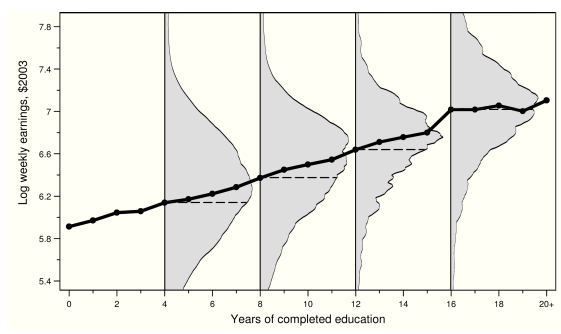
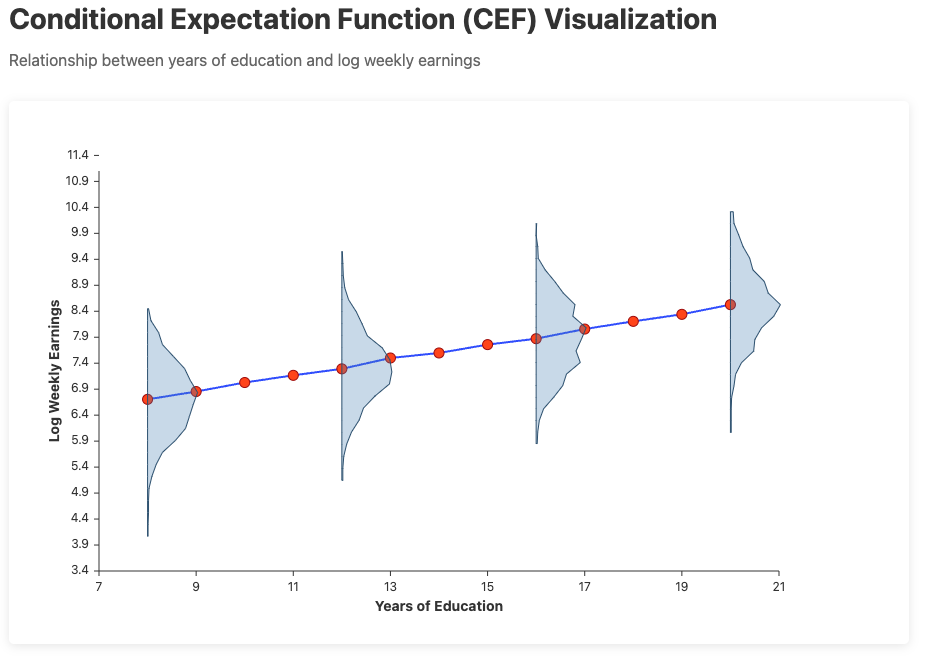

# README

Try to recreate the visaulization from MHE for conditional expectation function(CEF) using Svelte. 

Svelte instruction is from [here](https://svelte.dev/docs/llms).

# Data 
Simulated with Python.
Adjust as you like.

# Visualization Results

## Original Visualization


## New Visualization


# Iterations
Description of the process (Described by a human). 
Set up: VSCode with Github Copilot, used Chat and Claude Sonnet 3.7 in agent mode.

1. Install Svelte bare skeleton with type script. 
   ```bash
    npx sv create CEF-Visualization
    cd CEF-Visualization
    npm install
   ```

2. Download Svelte instruction from here [here](https://svelte.dev/docs/llms).

3. Asked to get simulated data.
```text
I want to simulate data and store it in static/data.csv
I want 1000 rows and two variables, years of education, from 8-20 years and log weekly earnings. They increase with more education. BUT have a big variation
```
**PS:** The simulated data was not that good so later I asked to rather simulate the data with pythin in [simulation.ipynb](simulation.ipynb). This gives more flexibility to adjust the data as I want. And take less time in total to get the data.

4. Described the orignal visualization of Conditional Expectation Function (CEF). Added that for some values on the x-axis there was also a probability density function (PDF) tilted 90 degrees to describe the distribution along the y-axis given the value on the x-axis. Asked it to give me an presentation of how it had understood the illustration. 

5. Then I got a good description that prooved for me that it also had found other resources on CEF. Then said that I wanted to recreate the visualization with Svelte.Tagged [svelte-medium-llm.txt](svelte-medium-llm.txt) file and said to look there for tips and tricks in Svelte. 

6. First draft ready in 15 minutes. Here I saw that I was not happy with the data so asked to simulate new data with Python as mentioned. The PDF was as a violin plot so asked to get only the right part of the violin plot. It has also a dot for every individual data point that i wanted to get rid of. And a couple of other things. Final result was ready after 30min in total time spent. 

### Why svelte?
I have tried this in `ggplot` in R and `plotly` in Python without Success. Found it difficult. Svelte is a JavaScript framework that is easy to use and has a lot of flexibility. It was created by Richard Harris who came from data visualization. So I thought it would be a good match. 